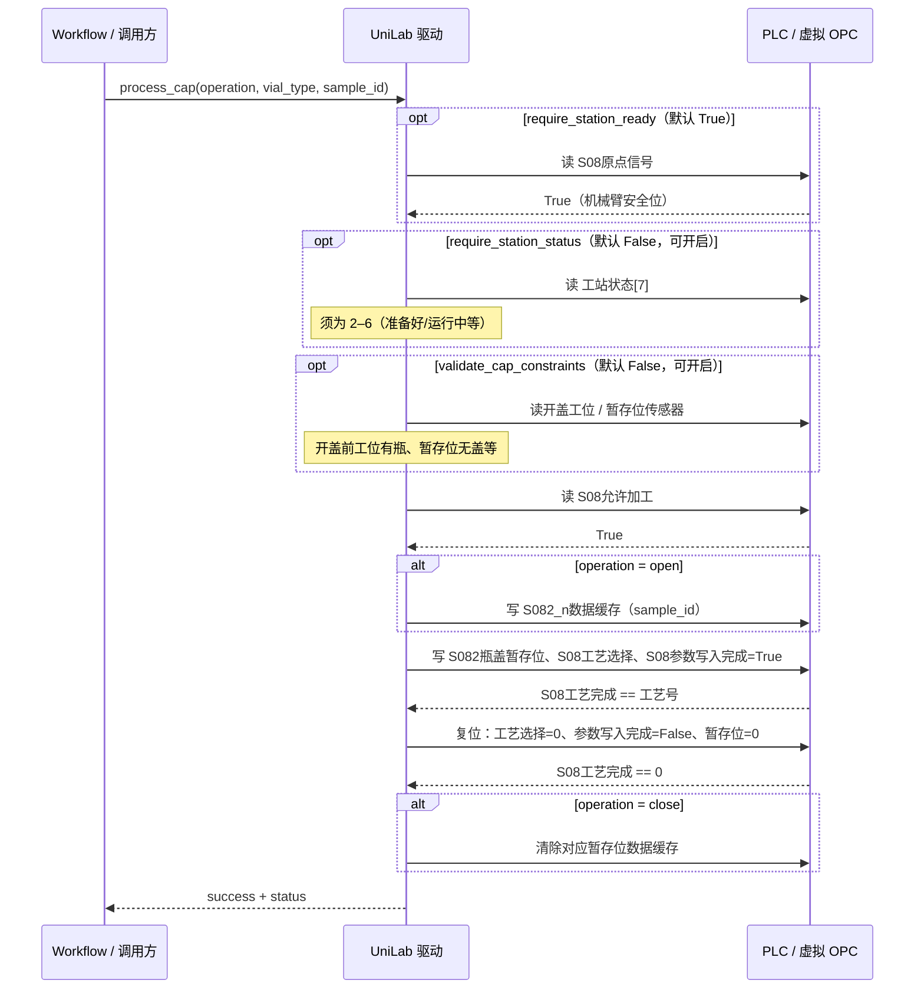

# S08 开盖/关盖工位（`szlab_s08_cap_station`）

苏州实验室 S08 开关盖工位驱动，直连 OPC UA。对外仅暴露一个 Action：**`process_cap`**。

- 驱动：`s08_cap_station.py`（`SZLabS08CapStationDevice`）
- OPC 客户端：`opcua_client.py`
- 变量表：`s08_nodes.csv`
- 本地调试：`debug_s08.py`、`s08_debug.json`

## 工艺编号（`S08工艺选择` / `S08工艺完成`）

| 编号 | 操作 | 瓶型 |
|------|------|------|
| 1 | 开盖 | 样品瓶 500ml（开盖工位 1，`NO[14]`） |
| 2 | 关盖 | 样品瓶 500ml |
| 3 | 开盖 | 样品瓶 250ml（开盖工位 1） |
| 4 | 关盖 | 样品瓶 250ml |
| 5 | 开盖 | 液体瓶 100ml（开盖工位 2，`NO[15]`） |
| 6 | 关盖 | 液体瓶 100ml |

开盖：机械臂传入 `sample_id`，驱动分配空闲暂存位（1–5），写入 `S082_{n}数据缓存` 并下发工艺。  
关盖：用相同 `sample_id` 反查暂存位，关盖成功后清除该位缓存。

## 常规流程（`process_cap`）

实机与虚拟 OPC 共用同一握手时序。**谁写入谁复位**；UniLab 不写入、不复位对端负责的变量（`S08工艺完成`、`S08允许加工`、`S08原点信号`、传感器等）。



### 可选校验开关

| 参数 | 默认 | 作用 |
|------|------|------|
| `require_station_ready` | `True` | 工艺前等待 `S08原点信号` |
| `require_station_status` | `False` | 工艺前检查 `工站状态[7]` ∈ {2,…,6} |
| `validate_cap_constraints` | `False` | 开/关盖前检查工位与暂存位传感器、样品 ID 与缓存一致性 |

`S08取放料产品` / `S08取放料编号` 由 workflow 写入，本驱动不读写。

## 测试

在仓库根目录 `Uni-Lab-OS/` 下执行（需已安装依赖，建议 `pip install -e .` 与 `pytest`）。

### 单元测试（mock OPC，CI 会跑）

共 **24** 项，均在 `tests/szlab_poly_studio/test_s08_cap_station.py`：

```bash
cd /path/to/Uni-Lab-OS
PYTHONPATH=. python -m pytest tests/szlab_poly_studio/test_s08_cap_station.py -v
```

简要分类：

| 数量 | 内容 |
|------|------|
| 2 | 注册表 / preset 仅暴露 `process_cap` |
| 5 | 内部实现（连接复位、NodeId 映射、等待工艺完成、虚拟/实机 URL） |
| 9 | `process_cap` 成功路径与入参校验（开/关、三种瓶型、槽位分配） |
| 8 | 开启 `require_station_status` / `validate_cap_constraints` 时的约束与默认跳过行为 |

### 虚拟 OPC UA 集成测试（CI 会跑）

```bash
PYTHONPATH=. python -m pytest tests/szlab_poly_studio/test_s08_cap_station_opcua_ci.py -v
```

### 单元 + 集成一次跑完

```bash
PYTHONPATH=. python -m pytest \
  tests/szlab_poly_studio/test_s08_cap_station.py \
  tests/szlab_poly_studio/test_s08_cap_station_opcua_ci.py \
  -v
```

### OPC UA CI manifest（与 CI 第三步相同）

```bash
PYTHONPATH=. python tests/psuedo_devices/common/run_opcua_ci.py
```

仅跑 S08 manifest 时，可设 glob（具体以 manifest 路径为准）：

```bash
PYTHONPATH=. python tests/psuedo_devices/common/run_opcua_ci.py \
  --manifest-glob 'tests/psuedo_devices/szlab_s08_cap_station/ci.json'
```

### 本地调试脚本（目录内）

虚拟 OPC 一键开盖（先起 csv server + flow daemon，再调 `process_cap`）：

```bash
cd /path/to/Uni-Lab-OS
PYTHONPATH=. python unilabos/devices/workstation/szlab_poly_studio/decap-s08/debug_s08.py --mode all
```

其他模式：

```bash
# 只起虚拟 OPC，保持运行
PYTHONPATH=. python unilabos/devices/workstation/szlab_poly_studio/decap-s08/debug_s08.py --mode serve

# 对已运行的虚拟 OPC 或真机执行 s08_debug.json 里的 action
PYTHONPATH=. python unilabos/devices/workstation/szlab_poly_studio/decap-s08/debug_s08.py --mode run

# 真机（production_url）
PYTHONPATH=. python unilabos/devices/workstation/szlab_poly_studio/decap-s08/debug_s08.py --mode run --production

# 清除本侧握手写点
PYTHONPATH=. python unilabos/devices/workstation/szlab_poly_studio/decap-s08/debug_s08.py --mode reset
```

### 实机 OPC UA 环境变量（可选）

```bash
export UNILABOS_SZLAB_S08_OPCUA_URL='opc.tcp://192.168.1.10:4840/'
```

未显式传入 `opcua_uplink_comm_prefix` 时，非本机地址会自动使用 `ns=4;s=上位机通讯` 的 NodeId 映射。
